## Structure
``` text
.
├── CMakeLists.txt
├── LICENSE
├── README.md
├── data
│   ├── petanque.scn
│   ├── rayure.exr
│   └── ...
├── include
│   ├── camera.h
│   ├── scene.h
│   ├── plane.h
│   ├── ray.h
│   └── ...
├── src
│   ├── main.cpp
│   ├── material.cpp
│   ├── scene.cpp
│   └── ...
└── results
    ├── petanque_direct.png
    ├── petanque_flat.png
    └── ...
```

## Examples of different integrators

| Flat | Normals | Direct | Whitted |
|:-------------------------:|:-------------------------:|:-------------------------:|:-------------------------:
| 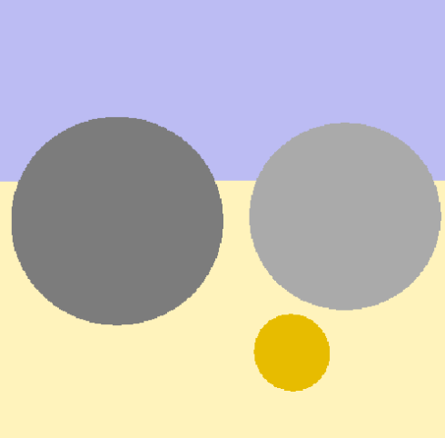 | 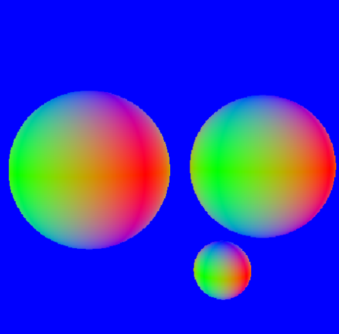 | 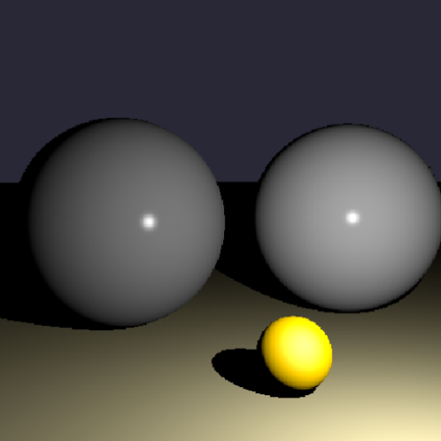 | 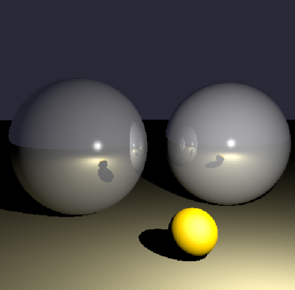 |
| 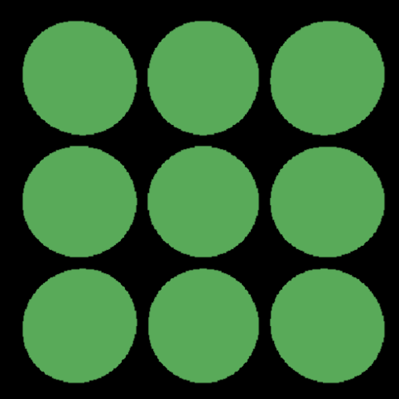 | 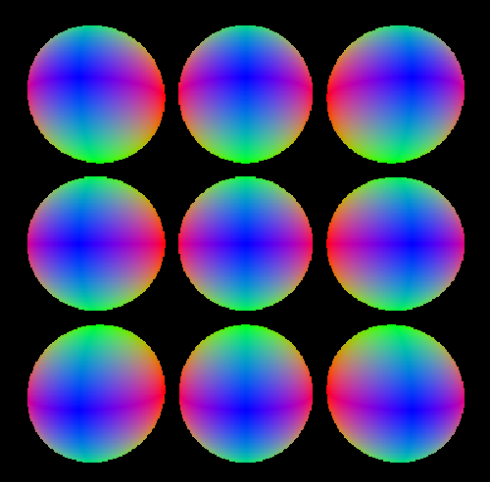 | 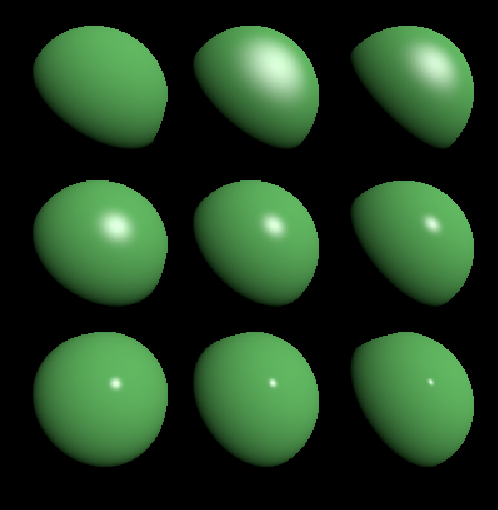 | 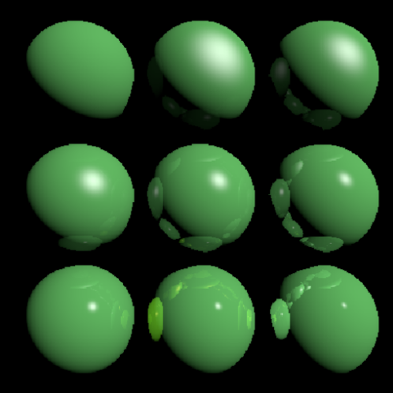 |
|  | 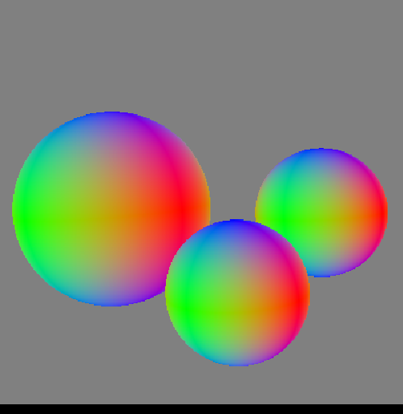 | 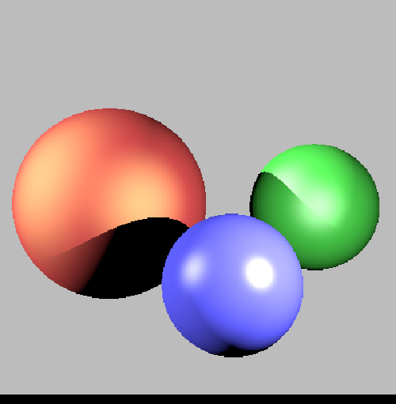 |  |
| 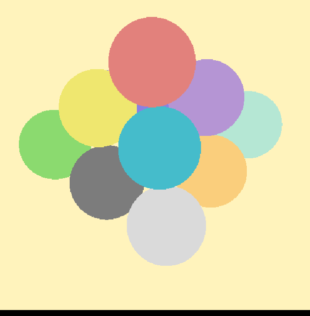 | 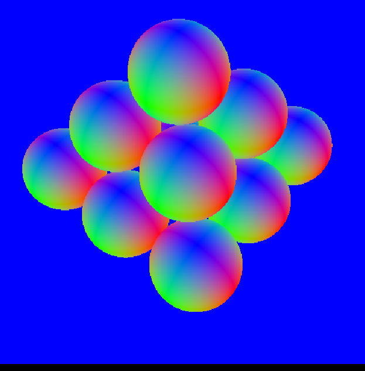 | 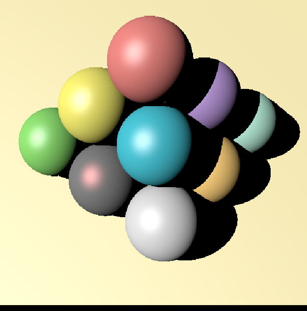 | 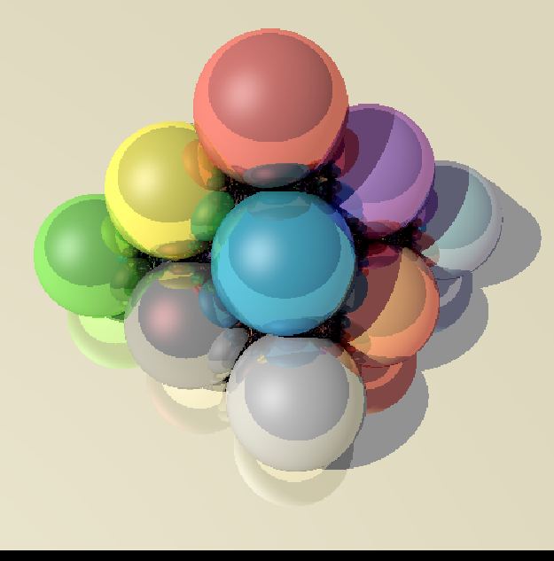 |

## Building

Build by making a build directory (i.e. `build/`), run `cmake` in that dir, and then use `make` to build the desired target.

Example:

``` bash
> mkdir build
> cd build
> cmake ../mds3d_td1
> make -j6
```

