## Raytracing c++
This repository contains the source code to render objects using raytracing

<!--  -->
<p align="center">
  
</p>

## Structure
``` text
.
├── CMakeLists.txt
├── LICENSE
├── README.md
├── data
│   ├── petanque.scn
│   ├── rayure.exr
│   └── ...
├── include
│   ├── camera.h
│   ├── scene.h
│   ├── plane.h
│   ├── ray.h
│   └── ...
├── src
│   ├── main.cpp
│   ├── material.cpp
│   ├── scene.cpp
│   └── ...
└── results
    ├── petanque_direct.png
    ├── petanque_flat.png
    └── ...
```

## Examples of different integrators

In the first part of the program, I have implemented the following integrators:

* Flat
* Normals
* Direct
* Whitted

| Flat | Normals | Direct | Whitted |
|:-------------------------:|:-------------------------:|:-------------------------:|:-------------------------:
| 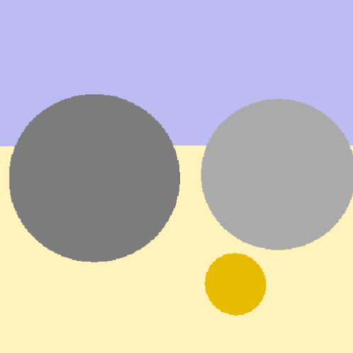 | 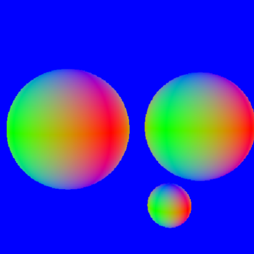 |  |  |
|  | 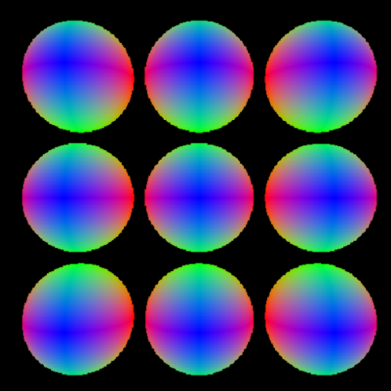 |  |  |
| 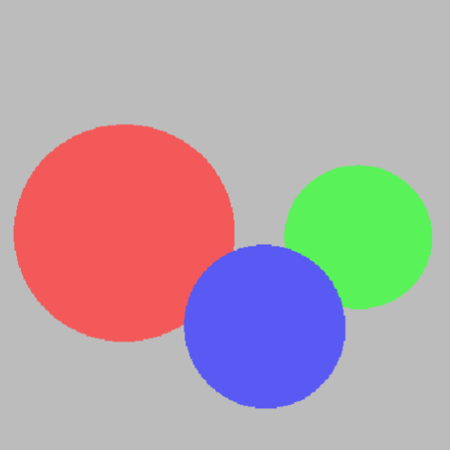 | 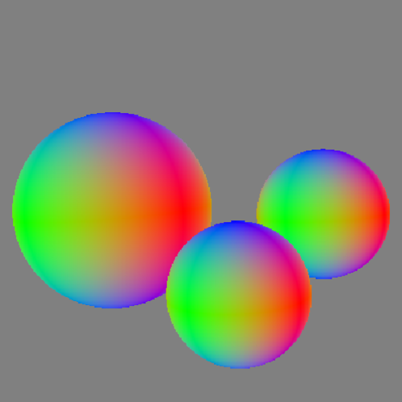 | 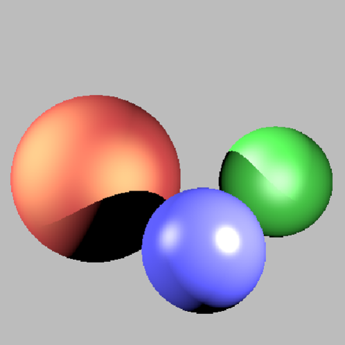 | 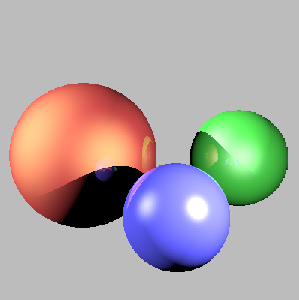 |
| 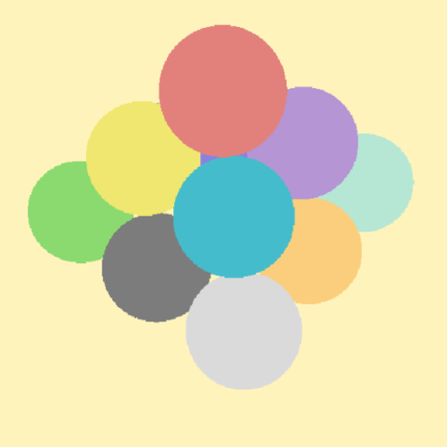 |  |  | 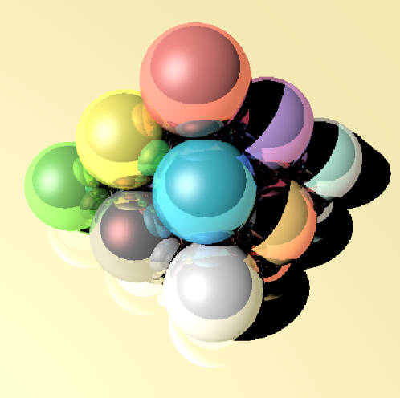 |

## Rendering Mesh

* BVH : When using BVH the time gains very remarkable (from 60s to 1s)

| Face Normals | Barycentriques Normals | Increasing Mesh Resolution |
|:-------------------------:|:-------------------------:|:-------------------------:|
|  | 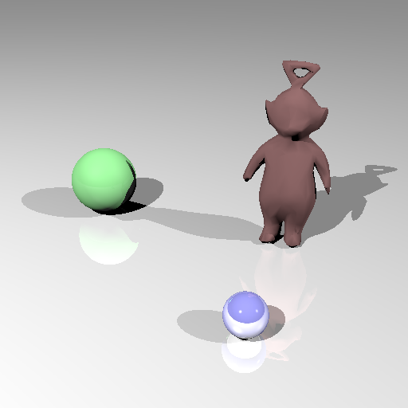 |  |

## Missing features

### Textures
| Petanque ⬜️ | Terre & Lune ⬜️ | Deux Plans ✅ | Tas Spheres ⬜️ |
|:-------------------------:|:-------------------------:|:-------------------------:|:-------------------------:|
| 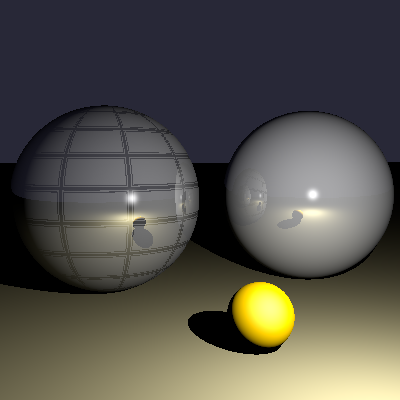 | 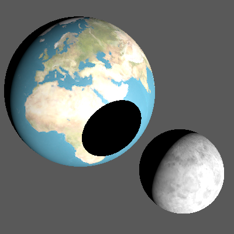 | 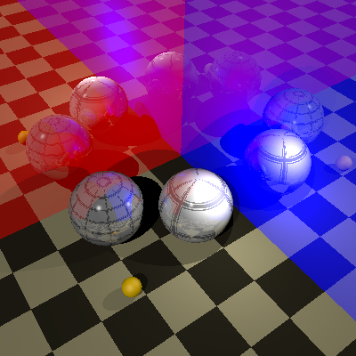 | 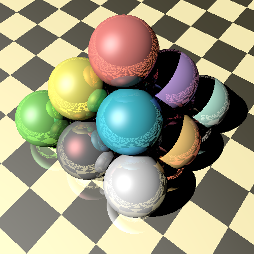 |

### Rednering killeroo

When trying to render killeroo, the program runs into an allocation error.

| Killeroo | Killeroo Glass |
|:-------------------------:|:-------------------------:|
| 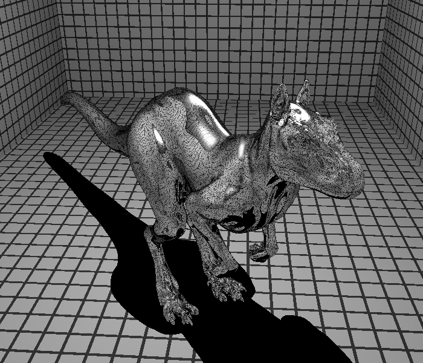 | 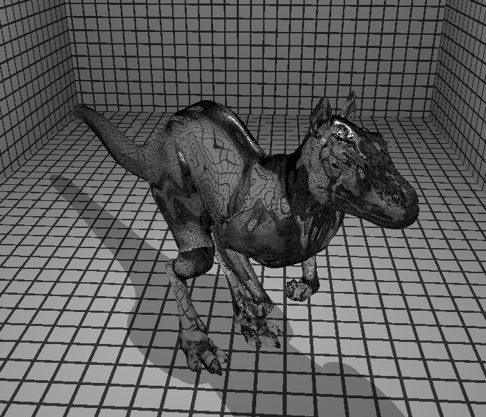 |


## Building and running the project

Build by making a build directory (i.e. `build/`), run `cmake` in that dir, and then use `make` to build the desired target.

#### First compilation:
  
``` bash
> mkdir build
> cd build
> cmake ../ray_tracing
> make -j6
```

#### Recompile:

``` bash
> cmake ../ray_tracing -DCMAKE_BUILD_TYPE=Debug
```

#### Run:

``` bash
> ./m3d_raytracer ../m3d_td1/data/troisSpheres.scn
```

## References
https://www.labri.fr/perso/pbenard/teaching/mondes3d/
